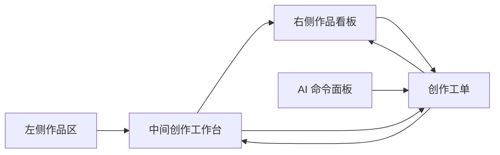
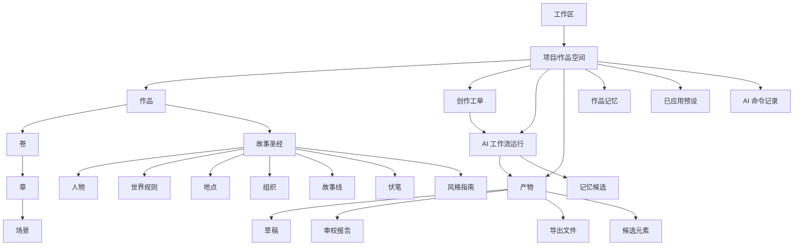

# 信息架构与页面结构

## 1. 信息架构目标

Story Pilot 的信息架构要服务完整创作过程，而不是服务聊天体验。核心目标是：

- 左侧让用户明确当前在哪个作品空间。
- 中间让用户稳定地完成创作生产。
- 右侧让用户持续看到工单、风险、产物、记忆和上下文。
- AI 能力嵌入每个对象和流程，产物必须沉淀为作品资产。
- 创作工单串联灵感、预设、设定、大纲、正文、审校、记忆和复盘。

总体结构为“左侧作品区 + 中间创作工作台 + 右侧作品看板 + 全局 AI 命令面板”。

## 2. 桌面端主窗口

主窗口由五块组成：

1. 窗口标题栏：原生窗口控制、当前作品路径、本地保存状态、全局快捷入口。
2. 左侧作品区：产品标识、作品列表、最近章节、记忆库、预设库、设置和账号状态。
3. 中间创作工作台：总览、预设、故事圣经、大纲、章节、伏笔、记忆、元素生成器、导出。
4. 右侧作品看板：默认窄栏折叠，展开后展示当前作品状态和 AI 任务。
5. AI 命令面板：覆盖式入口，用于搜索、自然语言命令、快速创建工单。

## 3. 左侧作品区

### 3.1 区域定位

左侧是作品空间管理，不是功能导航。每个项目代表一部作品、一个系列，或一个 IP 宇宙。

### 3.2 内容结构

从上到下建议为：

- 产品标识：Story Pilot、版本、本地或云端状态。
- 顶部功能入口：记忆库、预设库、设置。
- 作品列表标题和新建入口。
- 作品项目列表。
- 最近章节或最近对象。
- 账号与当前工作区。

### 3.3 作品项目项

每个作品项目应展示：

- 作品名。
- 项目类型：作品、系列、IP 宇宙。
- 当前状态：设定中、写作中、审校中、暂停、完结。
- 最近入口：最近章节、最近工单或最近对象。
- 待处理徽标：工单、风险、记忆候选。
- 更多操作：重命名、归档、导出、项目设置。

### 3.4 左侧规则

- 点击作品项目后，中间工作台打开该作品的最近视图。
- 左侧不放“聊天/工作台”切换，避免把聊天变成主流程。
- 左侧不展开复杂创作功能，避免和中间工作台重复。
- 当前作品有阻断风险时显示徽标，但具体处理在右侧看板和中间工作台完成。

## 4. 中间创作工作台

### 4.1 区域定位

中间是 Story Pilot 的主生产区域。用户日常停留在这里完成构思、写作、确认、审校和导出。

### 4.2 一级视图

| 视图 | 作用 | MVP |
|---|---|---|
| 总览 | 今日创作闭环、进行中工单、作品健康、下一步建议 | 是 |
| 预设 | 题材、读者、世界观、人物、冲突、节奏选择 | 是 |
| 故事圣经 | 人物、世界规则、地点、组织、风格 | 是 |
| 大纲 | 全书、分卷、章节、场景结构 | 是 |
| 章节 | 章节树、场景卡、正文编辑、局部 AI 操作 | 是 |
| 伏笔 | 伏笔状态、埋设、强化、回收 | 是 |
| 记忆 | 正史、草稿、假设、冲突、写回 | 是 |
| 元素生成器 | 人名、地名、组织、功法、标题和伏笔物件 | 是 |
| 导出 | 正文、设定和报告导出 | 是 |

### 4.3 工作台内部布局

不同视图可复用三种局部布局：

- 列表 + 内容：用于章节写作、记忆确认、大纲。
- 对象网格 + 详情：用于故事圣经、人物、世界规则。
- 控制面板 + 候选结果：用于预设向导、元素生成器。

工作台内部可以有当前视图的局部侧栏，例如章节树、对象类型、筛选条件；它不能替代最左侧作品区。

### 4.4 对象级 AI 操作

每个核心对象都可以暴露一组上下文相关的 AI 操作：

- 章节：生成草稿、续写、改写、润色、审校、抽取记忆。
- 人物：生成名字、补全动机、检查弧光、生成对白样本。
- 世界规则：生成规则、检查限制、设计冲突来源。
- 大纲：生成章节、调整节奏、压缩支线、设计高潮。
- 伏笔：生成埋设点、强化方案、回收方案、检查遗忘风险。
- 记忆：合并、冲突解释、影响范围分析。

这些操作不跳转到聊天页，而是创建或推进创作工单。

## 5. 右侧作品看板

### 5.1 区域定位

右侧作品看板是当前作品的控制台和预览层。它不是正文编辑区，也不是普通信息堆叠区。

### 5.2 折叠态

默认折叠态建议宽度 48 到 64 px。

显示：

- 进度图标。
- 任务图标。
- 风险图标。
- 产物图标。
- 记忆图标。
- 上下文图标。
- 徽标数量。

交互：

- 点击图标展开对应标签。
- hover 显示短 tooltip。
- 阻断风险使用克制但明确的红色徽标。

### 5.3 展开态

展开宽度建议 360 到 420 px。

标签：

- 进度：章节、字数、里程碑、今日任务。
- 任务：AI 工作流队列、待确认、阻断、已完成。
- 风险：连续性冲突、伏笔、人物动机、合规。
- 产物：最近生成的章节、设定、审校报告、导出文件。
- 记忆：候选事实、冲突记忆、最近写回。
- 上下文：当前 AI 任务或章节生成使用的上下文包。
- 预览：当前选中章节、人物、伏笔、规则的轻量详情。

### 5.4 看板规则

- 看板展示当前作品和当前中区选择的上下文。
- 看板跟随中间选中对象变化。
- AI 任务运行时，看板展示当前任务进度和阻断点。
- 看板不承载正文编辑，正文编辑始终在中间主区。
- 每个待处理项都能跳转到中间工作台处理。
- 没有关联工单的临时结果只进入最近活动，不进入待办。

## 6. AI 命令面板

### 6.1 区域定位

AI 命令面板是自然语言入口和快速命令入口。它不承担长对话，不替代工作台。

### 6.2 入口

- `Cmd+K`。
- 工作台顶部 AI 按钮。
- 对象操作中的“更多 AI 操作”。
- 看板待处理项中的“生成处理建议”。

### 6.3 内容结构

- 输入框。
- 推荐命令。
- 当前作用范围。
- 将创建的工单预览。
- 预计输入和输出。
- 风险提示。
- 执行按钮。

### 6.4 规则

- 命令面板的自然语言输入必须转化为工单、对象操作或搜索结果。
- 不能返回一段游离的聊天回答作为最终结果。
- 如果信息不足，系统进入“信息待完善”状态，并请求用户补齐关键字段。
- 执行后打开右侧任务详情抽屉，而不是打开聊天流。

## 7. AI 任务详情抽屉

### 7.1 区域定位

AI 任务详情抽屉展示单个工单或工作流运行的完整情况。它可以从右侧看板打开，也可以从工作台对象打开。

### 7.2 内容结构

- 工单标题和状态。
- 目标。
- 作用范围。
- 使用的上下文包。
- 运行阶段。
- 中间检查结果。
- 产物列表。
- 记忆候选。
- 用户决策记录。
- 下一步建议。

### 7.3 用户动作

- 暂停。
- 取消。
- 重新运行。
- 修改输入。
- 保存产物。
- 加入记忆候选。
- 应用到当前对象。
- 标记完成。

## 8. 对象体系

产品对象按作品空间组织。

## 9. 创作工单信息架构

创作工单是工作台、AI 工作流和右侧看板的连接层。

| 工单类型 | 来源 | 处理位置 | 产物 |
|---|---|---|---|
| 立项工单 | 新建作品、命令面板 | 预设、故事圣经 | 作品核心方案 |
| 世界观工单 | 预设、故事圣经 | 故事圣经 | 世界规则、组织、地点 |
| 人物工单 | 预设、元素生成器 | 人物视图、故事圣经 | 人物卡、人物声音 |
| 大纲工单 | 总览、命令面板 | 大纲视图 | 全书、分卷、章节大纲 |
| 章节工单 | 大纲、章节写作 | 章节写作 | 章节草稿、版本 |
| 伏笔工单 | 伏笔视图、审校 | 伏笔看板 | 伏笔状态变更 |
| 审校工单 | 章节写作、发布准备 | 审校报告、右侧看板 | 风险列表、修订建议 |
| 记忆工单 | 章节生成、对象修改 | 记忆确认 | 正史、草稿、假设记忆 |
| 复盘工单 | 阶段完成、卷完成 | 总览 | 阶段总结、下一步工单 |

工单状态在右侧看板聚合展示，在中间主区完成处理。AI 工作流可以生成提案和产物，但不能绕过工作台确认直接修改作品正史。

## 10. 页面结构

### 10.1 工作台总览

内容：

- 今日创作闭环。
- 进行中的工单。
- 作品健康。
- 最近章节。
- 待确认记忆。
- 阻断风险。
- 下一步建议。

### 10.2 预设向导

内容：

- 题材。
- 子类型。
- 读者与平台。
- 世界观骨架。
- 人物原型。
- 冲突引擎。
- 章节节奏。
- 已选组合和风险提示。

### 10.3 章节写作

内容：

- 章节树。
- 场景卡。
- 正文编辑器。
- 当前章节目标。
- AI 操作工具条。
- 版本记录。
- 审校入口。
- 记忆抽取入口。

### 10.4 AI 任务详情

内容：

- 工单信息。
- 运行步骤。
- 上下文包。
- 产物卡。
- 风险卡。
- 记忆候选。
- 决策按钮。

### 10.5 记忆确认

内容：

- 候选事实。
- 来源章节或对象。
- 当前正史对照。
- 冲突解释。
- 影响范围。
- 确认、保留草稿、拒绝、撤销。

## 11. 信息架构判断

Story Pilot 应比消费级 AI 写作工具更专业，但比传统内容管理后台更轻。用户不应该被迫学习 agent 术语。产品语言应该围绕作品、章节、人物、伏笔、记忆、任务和产物展开。

自然语言输入是必要的，但它应该是命令能力，不是主界面。主界面必须让用户看到作品资产如何增长、风险如何被处理、正史如何被保护。
