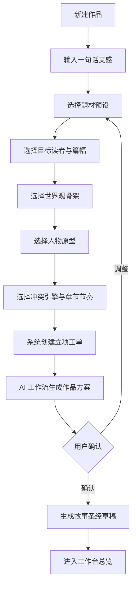
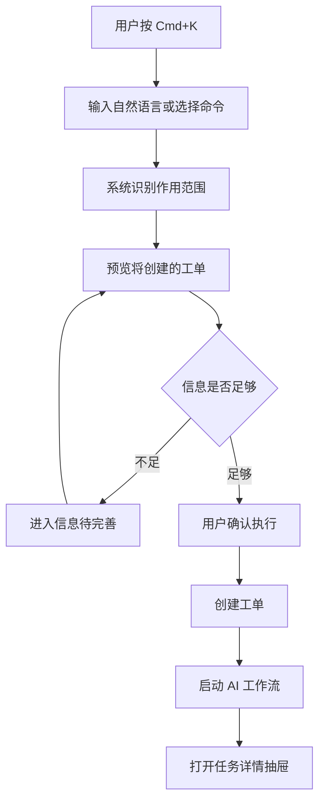
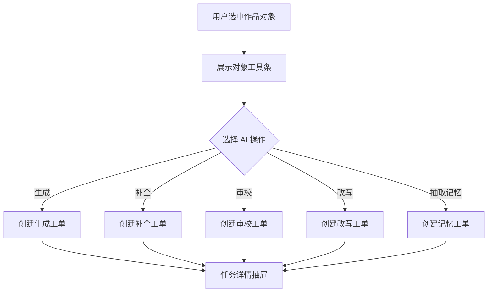
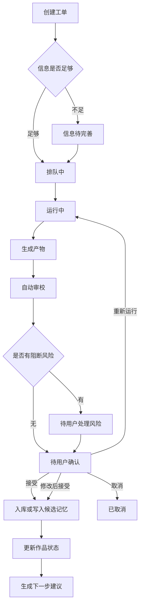
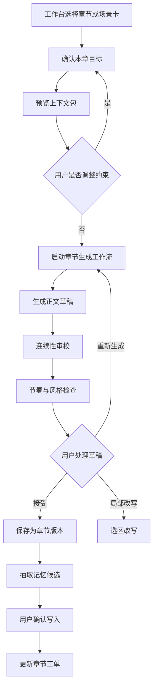
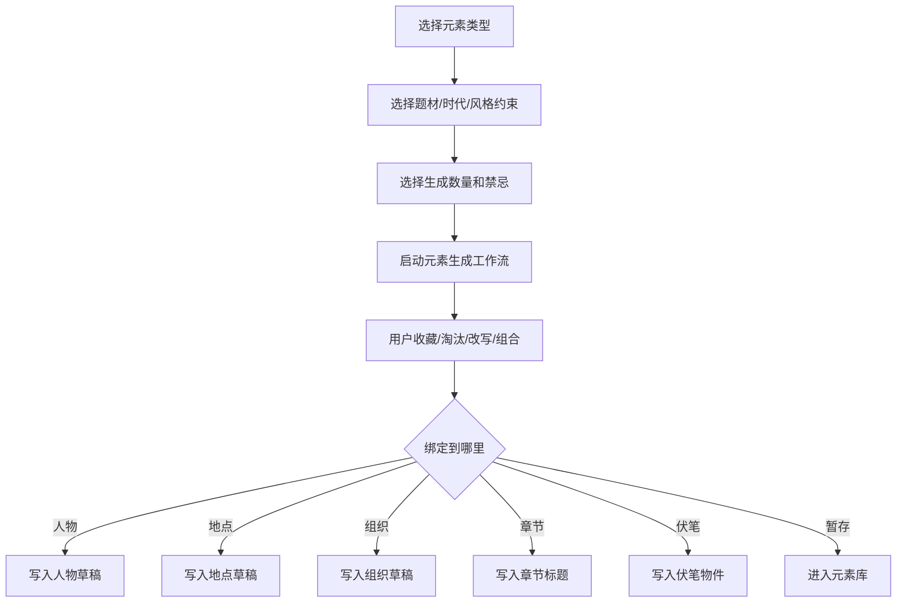
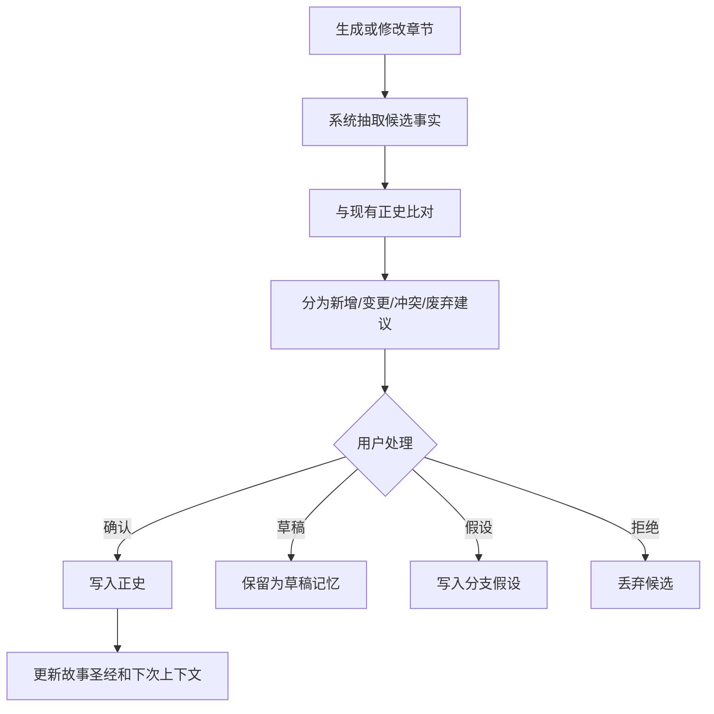

# 交互设计

## 1. 交互设计目标

Story Pilot 的交互应让用户感觉自己在一个作品空间里完成创作生产，而不是在和一个聊天机器人反复解释需求。

关键原则：

- 工作台优先：用户默认在结构化界面里创作、确认和管理资产。
- AI 就地发生：在章节、人物、伏笔、设定、选区等对象上直接触发 AI 操作。
- 命令面板兜底：开放式需求通过 `Cmd+K` 转化为工单和工作流。
- 产物必须入库：AI 结果要保存为作品对象、章节版本、审校报告或记忆候选。
- 看板驱动处理：右侧看板展示任务、风险、产物和记忆，并能跳转处理。
- 正史必须确认：关键设定、人物状态、时间线和记忆写入必须由用户确认。
- 工单串联闭环：每次 AI 行为都应有工单、上下文、运行记录、产物和决策。

## 2. 核心任务流

### 2.1 新作品创建与预设引导

交互要点：

- 每一步先给可点选预设，不强迫用户自由输入。
- 预设卡展示“创作收益”和“常见风险”。
- 用户可以组合多个预设，例如“东方玄幻 + 悬疑解谜 + 低开高走”。
- 系统生成的是作品核心方案和故事圣经草稿，不直接写入正史。
- 右侧看板同步显示将创建的立项、世界观、人物和大纲工单。

### 2.2 AI 命令面板转工单

交互规则：

- 命令面板不能直接返回游离答案。
- 每条自然语言需求必须转化为搜索、对象操作或创作工单。
- 工单预览要展示目标、范围、输入、预计产物和风险。
- 用户确认前不执行长任务。
- 执行后不打开聊天流，而是打开右侧任务详情抽屉。

示例：

| 用户输入 | 系统识别 | 创建工单 |
|---|---|---|
| 检查第 12 章伏笔是不是暴露太早 | 第 12 章 + 伏笔线 | 审校工单 |
| 给青铜铃起 20 个别名 | 当前伏笔物件 | 元素生成工单 |
| 把林照写得更克制一点 | 当前人物 + 当前章节 | 改写工单 |
| 重新规划第一卷结尾 | 第一卷 + 主线 | 大纲工单 |

### 2.3 对象级 AI 操作

对象级操作示例：

- 人物卡：生成名字、补全动机、检查弧光、生成对白样本。
- 世界规则：生成限制、检查冲突、补充代价和禁忌。
- 大纲节点：扩写章节、调整节奏、设计反转。
- 章节正文：续写、扩写、压缩、润色、降 AI 腔。
- 伏笔条目：建议埋设、强化、回收、废弃。
- 记忆候选：解释冲突、合并事实、分析影响范围。

交互规则：

- AI 操作入口跟随当前对象，不离开当前工作台视图。
- 执行结果默认回到当前对象处理。
- 对高风险修改，系统只生成 Patch Proposal，不直接覆盖原文。
- 所有操作进入工单记录，右侧看板可追踪。

### 2.4 创作工单流转

交互要点：

- 工单状态由系统状态机驱动，不由 UI 手写假进度。
- 用户可以暂停、取消、重新运行或修改输入。
- 产物入库后工单才算完成。
- 工单完成后必须更新作品看板，并可能生成下一步工单。

### 2.5 章节生成

交互要点：

- 章节生成入口在章节工作台，不在聊天页。
- 生成前显示上下文包摘要，用户可调整。
- 生成过程中编辑器仍可输入，但正在生成的段落保持可识别。
- 审校结果作为建议，不直接修改正文。
- 接受章节版本不等于接受所有记忆写入。

### 2.6 选区改写

用户在正文编辑器选中文本后出现浮动工具条。

建议操作：

- 润色。
- 扩写。
- 压缩。
- 加强冲突。
- 加强情绪。
- 降低 AI 腔。
- 保持人物声音改写。
- 检查设定冲突。

交互规则：

- 改写结果以候选形式出现。
- 用户可以对比原文和候选。
- 用户可以替换、插入到下方、复制或丢弃。
- 替换正文后自动生成版本快照。
- 如果改写引入新事实，进入记忆候选队列。

### 2.7 元素生成器

交互要点：

- 人物名展示读音感、含义、性别倾向、时代感、题材适配。
- 地名和组织名展示世界观适配度。
- 章节标题展示悬念强度和信息暴露风险。
- 重名、过于现代、过于网感或风格冲突要提示。
- 被选中的元素必须绑定到作品对象或进入元素库。

### 2.8 记忆写回

交互要点：

- 记忆候选必须展示来源章节、段落或对象。
- 冲突记忆不能批量静默确认。
- 正史变更要提示影响范围。
- 写入后可撤销。

## 3. 三分区交互规则

### 3.1 左侧作品区

- 点击作品：切换当前作品。
- 点击新建：打开作品创建和预设向导。
- 点击更多：重命名、归档、导出、项目设置。
- 点击最近章节：打开章节工作台。
- 作品存在风险时显示徽标，不在左侧展开复杂问题。

### 3.2 中间工作台

- 顶部固定显示当前作品路径和工作台视图。
- 二级视图切换不改变当前作品。
- 对象详情中保留 AI 操作工具条。
- 长任务执行时中间不被强制遮挡，任务进度进入右侧抽屉。
- 当前对象可以发送到命令面板作为作用范围。

### 3.3 右侧作品看板

折叠态：

- 点击图标展开对应标签。
- 显示待处理数量。
- 阻断风险高亮，但不弹窗。

展开态：

- 看板标签包括进度、任务、风险、产物、记忆、上下文、预览。
- 点击问题跳转到中间处理位置。
- 点击产物可打开、保存、导出或丢弃。
- 点击记忆候选进入确认流。
- 点击上下文包可查看本次生成依据。
- 每个待处理项显示关联工单。

### 3.4 AI 任务详情抽屉

- 从看板、命令面板、对象工具条或工单列表打开。
- 抽屉可覆盖在右侧，也可扩展为宽面板。
- 运行中展示阶段进度和最近日志。
- 完成后展示产物、风险和记忆候选。
- 抽屉关闭不终止任务。

## 4. 快捷键

| 快捷键 | 操作 |
|---|---|
| Cmd+K | 打开 AI 命令面板 |
| Cmd+1 | 工作台总览 |
| Cmd+2 | 章节写作 |
| Cmd+3 | 故事圣经 |
| Cmd+4 | 大纲 |
| Cmd+5 | 伏笔 |
| Cmd+6 | 记忆 |
| Cmd+B | 折叠或展开右侧看板 |
| Cmd+Enter | 执行当前 AI 操作 |
| Cmd+S | 保存当前草稿 |
| Cmd+Shift+R | 运行当前对象审校 |

## 5. 状态与反馈

### 5.1 AI 工作流状态

- 排队中：显示在看板任务队列。
- 装配上下文：展示正在读取的章节、记忆和对象。
- 运行中：展示阶段进度，可取消。
- 待用户确认：展示产物和决策按钮。
- 风险待处理：展示阻断原因和跳转入口。
- 已入库：展示写入位置。
- 已取消：保留运行记录。
- 失败：展示失败原因、可重试动作和已保留产物。

### 5.2 空状态

- 新作品空状态：引导进入预设向导。
- 无章节空状态：引导生成大纲和第 1 章工单。
- 无记忆空状态：解释正史记忆来自用户确认。
- 无任务空状态：展示下一步推荐动作。

### 5.3 错误状态

- 模型调用失败：保留工单和输入，允许重试或切换模型。
- 上下文过长：展示压缩策略，让用户选择更严格范围。
- 记忆冲突：标红冲突事实，禁止静默写入。
- 文件保存失败：提示本地路径和重试动作。
- 产物解析失败：展示原始结果，并允许重新结构化。

## 6. 可用性约束

- 不把 AI 功能藏在复杂菜单里，每个核心对象至少有一个主 AI 动作。
- 不让用户在长对话里寻找设定，所有设定必须能沉淀到故事圣经。
- 不让 AI 自动覆盖用户正文，默认生成候选或版本。
- 不让看板堆满历史信息，只展示当前作品和当前对象相关内容。
- 不让命令面板变成聊天窗口，输入必须落到动作、对象或工单。

## 7. 关键文案规范

推荐使用：

- “生成章节草稿”
- “运行连续性审校”
- “加入记忆候选”
- “确认写入正史”
- “创建章节工单”
- “查看上下文包”
- “应用到当前章节”
- “重新运行”

避免使用：

- “智能体模式”
- “和 AI 聊聊”
- “开始对话”
- “机器人正在思考”
- “自动改正史”
- “一键完稿”

产品语言要强调创作控制、作品资产和确认边界。
