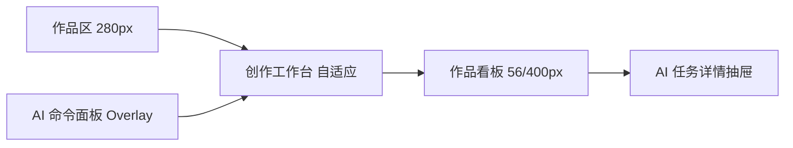
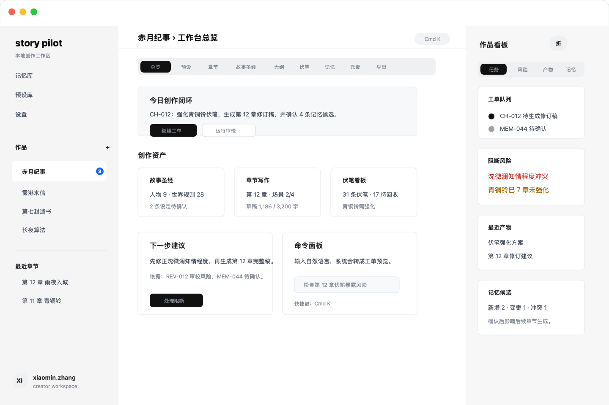
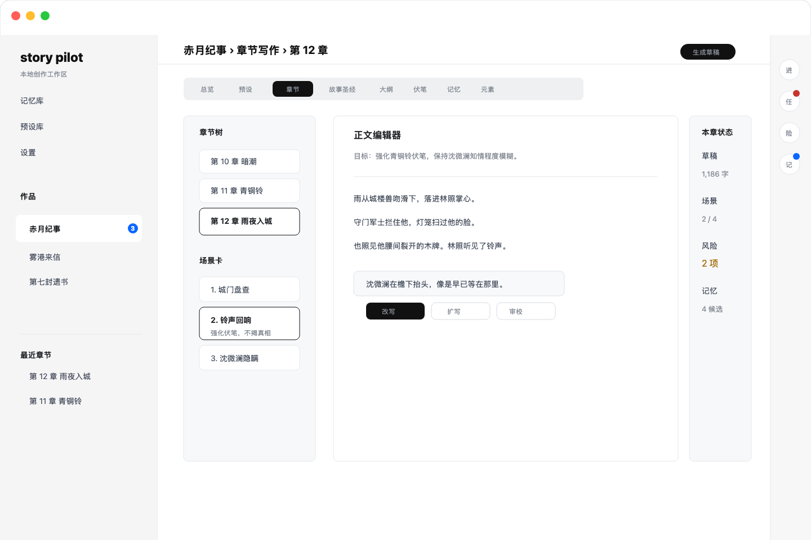
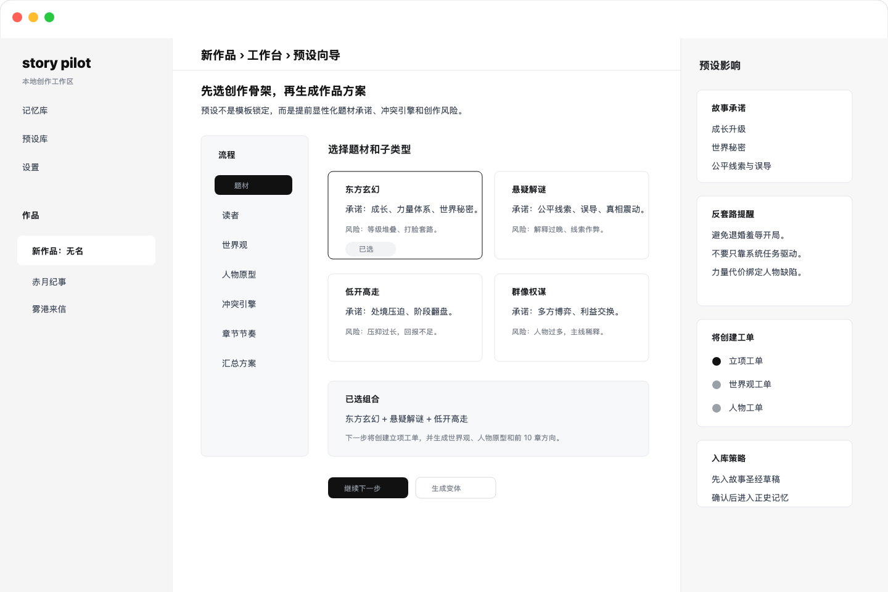
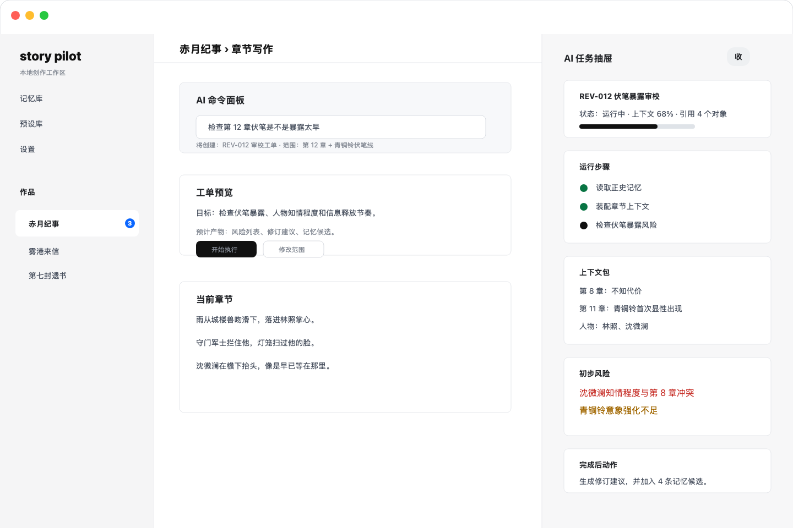

# 视觉设计与高保真界面稿

## 1. 视觉方向

Story Pilot 的视觉方向参考 Friday 的清爽桌面端风格：浅色背景、克制边框、弱阴影、紧凑导航、明确的左右分区和高信息可读性。

但 Story Pilot 不能直接复制 Friday 的聊天中心结构。小说创作产品需要更强的资产感、编辑感和工作台感，因此视觉重心应落在：

- 当前作品空间。
- 当前创作视图。
- 当前章节或对象。
- 当前 AI 工单。
- 待确认产物和记忆。

设计读法：桌面端创作生产工具，面向专业作者和 AI-first 创作者，视觉语言是 Friday 式克制、工作台式高可读、低装饰。

建议视觉参数：

- 设计变化度：4/10，保持稳定布局。
- 动效强度：3/10，只做状态转场和任务进度反馈。
- 信息密度：7/10，偏生产工具，但不做后台报表感。

## 2. 核心视觉原则

### 2.1 工作台优先

中间区域默认展示创作工作台。工作台顶部使用清晰的视图标签：总览、预设、章节、故事圣经、大纲、伏笔、记忆、元素生成器、导出。

### 2.2 AI 融入对象

AI 不用大面积聊天容器表达。它应通过以下形态出现：

- 对象工具条。
- 命令面板。
- 任务抽屉。
- 产物卡。
- 记忆候选卡。
- 审校风险卡。

### 2.3 右侧看板是控制台

右侧看板要像作品状态控制台，不像普通详情栏。它需要稳定展示任务、风险、产物和记忆候选，并让用户能一跳处理。

### 2.4 克制使用颜色

基础色：

- 背景：接近白色。
- 左侧栏：浅灰。
- 主区：白色。
- 分割线：浅灰线。
- 主文本：接近黑色。
- 次文本：中性灰。

语义色：

- 蓝色：当前焦点、通知徽标。
- 红色：阻断风险。
- 琥珀色：待处理风险。
- 绿色：已确认、已入库。

避免：

- AI 紫色渐变。
- 大面积彩色背景。
- 装饰性光效。
- 过度圆角卡片。

### 2.5 卡片使用规则

卡片只用于承载明确对象：

- 工单。
- 章节。
- 人物。
- 伏笔。
- 记忆候选。
- 审校风险。
- AI 产物。

页面区块不要卡片套卡片。工作台主区应以留白、分割线和面板组织信息。

## 3. 桌面端布局规格

### 3.1 推荐尺寸

- 最小桌面宽度：1280 px。
- 推荐设计画布：1440 x 960。
- 左侧作品区：280 px。
- 中间工作台：自适应，最小 720 px。
- 右侧看板折叠态：56 px。
- 右侧看板展开态：360 到 420 px。
- 命令面板宽度：640 到 760 px。

### 3.2 区域层级

### 3.3 折叠策略

- 默认展开左侧作品区。
- 默认折叠右侧看板，但保留窄栏图标和徽标。
- 运行 AI 工作流时，右侧自动展开任务标签或打开任务抽屉。
- 写作沉浸状态下，右侧可完全收起，只保留返回按钮。

## 4. 主要界面说明

### 4.1 工作台总览

画面目标：

- 用户打开作品后直接进入总览。
- 中间展示今日创作闭环、最近章节、资产状态和下一步建议。
- 右侧展示 AI 任务、阻断风险和记忆候选。
- 左侧只负责作品切换，不提供聊天模式切换。

### 4.2 章节写作

画面目标：

- 中间是章节生产主界面。
- 左子栏为章节树和场景卡。
- 正文编辑区提供选区改写、生成草稿、审校和记忆抽取。
- 右侧看板展示当前章节工单和风险。

### 4.3 预设向导

画面目标：

- 用系统预设降低空白页压力。
- 每张预设卡展示故事承诺和套路风险。
- 右侧提示预设将创建的工单、入库策略和反套路提醒。
- 用户确认后生成故事圣经草稿。

### 4.4 AI 任务抽屉

画面目标：

- 展示单个 AI 工作流的目标、上下文包、运行步骤、产物和记忆候选。
- 用户可以保存、应用、重新运行、取消或确认写入。
- 任务抽屉替代常驻聊天流，成为 AI 可观测性的主要界面。

## 5. 关键组件

### 5.1 工作台导航

形式：

- 横向标签。
- 当前项黑底白字。
- 次级项灰色文字。
- 高度紧凑，不占用编辑空间。

标签：

- 总览。
- 预设。
- 章节。
- 故事圣经。
- 大纲。
- 伏笔。
- 记忆。
- 元素。
- 导出。

### 5.2 AI 操作按钮

形式：

- 黑色主按钮用于当前最重要动作，例如“生成修订稿”。
- 白底描边按钮用于次要动作，例如“运行审校”。
- 文案使用动作 + 对象，不使用“和 AI 聊聊”。

### 5.3 命令面板

形式：

- 居中覆盖。
- 顶部输入框。
- 下方展示推荐命令、作用范围、工单预览。
- 执行后关闭面板并打开任务抽屉。

### 5.4 任务抽屉

形式：

- 从右侧展开。
- 比普通看板更宽。
- 以阶段列表和产物卡组织信息。
- 允许查看上下文包，但默认只展示摘要。

### 5.5 记忆候选卡

必须展示：

- 候选事实。
- 来源。
- 与正史关系。
- 影响范围。
- 操作：确认、草稿、拒绝。

## 6. Friday 风格取舍

保留：

- 三分区桌面框架。
- 左侧项目列表。
- 右侧折叠看板。
- 浅灰背景、白色主区、细边框。
- 克制按钮和紧凑列表。

不保留：

- 中间大面积对话流作为主界面。
- 左侧“智能体/工作台”模式切换。
- 把 AI 运行过程当作聊天消息展示。
- 让产物停留在会话中。

## 7. 视觉验收标准

- 打开作品后第一屏能明确看到工作台，而不是聊天。
- 任何 AI 任务都有工单状态和产物去向。
- 右侧看板折叠态不会干扰正文写作。
- 右侧展开态能快速回答当前作品风险和下一步。
- 命令面板像专业软件快捷入口，不像聊天窗口。
- 所有按钮文案在桌面宽度下不换行。
- 页面无装饰性大渐变、无 AI 紫色套路、无无意义状态点。
