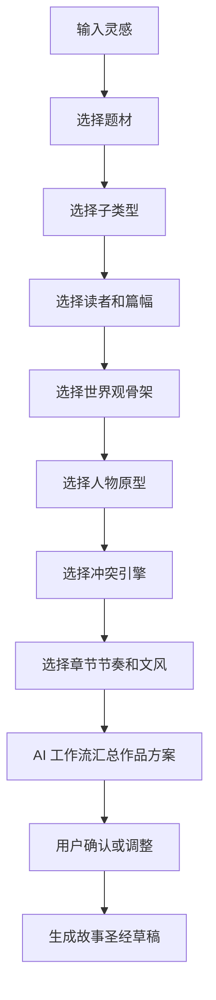

# 创作预设系统与元素生成器

## 1. 设计目标

创作预设系统和元素生成器的目标不是把小说创作模板化，而是降低空白页压力、提升构思效率，并把成熟创作方法论转化为可选择、可组合、可修改、可入库的产品能力。

核心原则：

- 预设帮助启动，不替代作者判断。
- 预设必须展示风险，避免放大套路化。
- AI 生成元素必须绑定作品上下文，避免孤立起名。
- 被采用的内容必须进入故事圣经草稿或元素库。
- 进入正史前必须由用户确认。

## 2. 创作预设体系

### 2.1 预设层级

预设分为七层：

1. 题材预设。
2. 子类型预设。
3. 读者与平台预设。
4. 世界观骨架预设。
5. 人物原型预设。
6. 冲突与剧情引擎预设。
7. 章节节奏与文风预设。

这些预设不是孤立标签，而是会影响后续生成、审校、上下文装配和复盘。

### 2.2 题材预设

示例：

- 东方玄幻。
- 仙侠修真。
- 都市异能。
- 古代言情。
- 现代言情。
- 悬疑推理。
- 科幻冒险。
- 无限流。
- 现实题材。
- 轻小说。

每个题材预设包含：

- 核心读者期待。
- 常见故事承诺。
- 常见爽点或情绪回报。
- 常见风险。
- 推荐世界观骨架。
- 推荐人物原型。
- 推荐章节节奏。

### 2.3 子类型预设

示例：

- 废柴逆袭。
- 低开高走。
- 群像权谋。
- 规则怪谈。
- 无限副本。
- 破镜重圆。
- 先婚后爱。
- 探案单元剧。
- 末世求生。
- 学院成长。

子类型预设用于进一步明确故事引擎。

### 2.4 读者与平台预设

示例：

- 男频爽文。
- 女频情绪流。
- 悬疑强钩子。
- 轻松日常。
- 长篇连载。
- 中短篇完结。
- IP 改编潜力。

这类预设影响：

- 章节长度。
- 开篇速度。
- 信息释放密度。
- 爽点或情绪回报频率。
- 伏笔回收节奏。
- 文风和对白。

### 2.5 世界观骨架预设

世界观预设不应只给名词，而要给规则和冲突。

示例：

- 等级修炼体系。
- 资源垄断体系。
- 秘密历史体系。
- 多势力制衡体系。
- 城市异能体系。
- 副本规则体系。
- 科技伦理体系。
- 家族门阀体系。

每个世界观骨架包含：

- 核心资源。
- 权力结构。
- 力量来源。
- 使用代价。
- 禁忌规则。
- 可生成冲突。
- 可埋伏笔。

### 2.6 人物原型预设

人物原型不是脸谱，而是剧情功能和变化方向。

示例：

- 带伤主角。
- 隐瞒真相的同盟。
- 亦师亦敌的导师。
- 资源掌控型反派。
- 道德困境型对手。
- 情绪回报型关系对象。
- 旧秩序守门人。
- 被牺牲者。

每个人物原型包含：

- 外在目标。
- 内在需求。
- 常见误信。
- 可制造冲突。
- 角色弧光。
- 与主角关系。
- 常见套路风险。

### 2.7 冲突与剧情引擎预设

示例：

- 身份谎言。
- 资源争夺。
- 禁忌能力。
- 家族债务。
- 历史骗局。
- 制度压迫。
- 爱与责任冲突。
- 记忆缺失。
- 权力继承。

每个冲突引擎包含：

- 初始矛盾。
- 升级方式。
- 阶段回报。
- 失败代价。
- 可关联人物。
- 可关联世界规则。
- 可关联伏笔。

### 2.8 章节节奏预设

示例：

- 快速钩子型。
- 慢热悬疑型。
- 单章小闭环型。
- 三章一回报型。
- 五章小高潮型。
- 日常铺垫型。
- 高密度反转型。

章节节奏预设影响：

- 开章钩子。
- 单章目标。
- 冲突密度。
- 信息释放。
- 结尾悬念。
- 审校标准。

## 3. 预设交互

### 3.1 默认路径

### 3.2 卡片信息

每张预设卡展示：

- 名称。
- 适用题材。
- 读者期待。
- 创作收益。
- 常见风险。
- 推荐组合。
- 不推荐组合。

### 3.3 反套路机制

每当用户选择高频预设组合时，系统应提示：

- 该组合常见套路是什么。
- 哪些地方容易同质化。
- 可以从哪三个方向做差异化。
- 哪些设定不建议再叠加。

示例：

用户选择“东方玄幻 + 废柴逆袭 + 等级修炼 + 家族压迫”时，系统提示：

- 常见风险：开局退婚、被族人羞辱、获得神秘系统后快速打脸。
- 差异化建议：把力量代价绑定记忆；让家族压迫来自制度而非脸谱恶人；把升级回报和身份真相绑定。

### 3.4 预设的生命周期

预设状态：

- 推荐：系统默认可选。
- 已选：进入当前作品方案。
- 已应用：已生成故事圣经草稿。
- 已确认：进入作品正史或风格约束。
- 已调整：用户修改过。
- 已废弃：不再作为后续生成约束。

预设变更后，应提示影响范围：

- 可能影响人物。
- 可能影响世界规则。
- 可能影响前文大纲。
- 可能影响章节生成约束。

## 4. 元素生成器

### 4.1 定位

元素生成器是工作台中的专门工具，也可以被命令面板和对象级 AI 操作调用。它用于生成作品中的命名、概念、物件和标题，但必须绑定当前作品上下文。

它不是一个孤立的起名工具。

### 4.2 支持元素类型

MVP 支持：

- 人物姓名。
- 地名。
- 组织/门派/公司/家族名。
- 章节标题。
- 卷名。

P1 支持：

- 功法/技能/异能名。
- 道具/神器/科技装置名。
- 称号、代号、外号。
- 伏笔物件。
- 世界规则概念。

P2 支持：

- 多语言命名。
- 海外版本译名。
- 方言/古语/外语风格变体。
- IP 视觉设定关键词。

### 4.3 生成控制项

通用控制项：

- 元素类型。
- 生成数量。
- 题材风格。
- 时代感。
- 语言风格。
- 字数或长度。
- 是否需要含义。
- 禁用字或禁用词。
- 已有元素去重。
- 是否偏现实或偏幻想。

人物名控制项：

- 性别倾向。
- 年龄段。
- 阶层身份。
- 地域或族群风格。
- 气质关键词。
- 是否需要外号或称号。

地名控制项：

- 地理类型。
- 氛围。
- 历史感。
- 势力归属。
- 是否暗含伏笔。

组织名控制项：

- 组织类型。
- 权力风格。
- 正邪倾向。
- 历史长度。
- 是否需要简称。

章节标题控制项：

- 是否强悬念。
- 是否含动作。
- 是否含伏笔。
- 信息暴露程度。
- 与前后章节的连贯性。

### 4.4 候选结果信息

每个候选结果展示：

- 名称。
- 简短含义。
- 适配理由。
- 风格标签。
- 风险提示。
- 可绑定对象。

人物名示例字段：

- 名称：林照。
- 含义：照见旧事，也暗合记忆主题。
- 气质：克制、清冷、带旧伤。
- 风险：较文学化，若作品偏爽文需配更强外号。

章节标题示例字段：

- 标题：雨夜入城。
- 信息量：低。
- 悬念：中。
- 适配：适合铺垫和伏笔强化。
- 风险：不够强钩子，可改为“第二声铃”。

### 4.5 选择与入库

候选操作：

- 收藏。
- 淘汰。
- 改写。
- 生成类似。
- 组合。
- 批量选择。
- 绑定到对象。
- 加入元素库。

入库规则：

- 绑定到人物、地点、组织、章节或伏笔后，进入对应对象草稿。
- 用户确认后进入正史或正式标题。
- 未绑定候选只保存在元素库，不影响后续生成。
- 被淘汰候选进入负样本，避免短期重复生成。

## 5. 与 AI 工作流的关系

AI 工作流可以调用预设系统和元素生成器，但不能绕过工作台确认。命令面板中的自然语言请求也必须先转化为工单，再调用对应生成能力。

示例：

- 用户在命令面板输入“帮我起 20 个适合这个世界观的门派名”。
- 系统创建元素生成工单。
- AI 工作流调用元素生成器。
- 任务抽屉显示候选结果和风险提示。
- 用户选择 5 个。
- 系统提示“保存到组织草稿”。
- 用户确认后进入故事圣经。

## 6. 与记忆系统的关系

预设和元素不是全部都进入长期记忆。

进入记忆的内容：

- 已确认题材承诺。
- 已确认世界规则。
- 已确认人物身份和命名。
- 已确认组织、地点、章节标题。
- 被明确废弃的关键方向。

不进入正史记忆的内容：

- 未选候选。
- 临时灵感。
- 纯展示型解释。
- 未确认的备选方案。

## 7. MVP 验收

MVP 中预设系统和元素生成器至少要支持：

- 用户通过预设完成新作品基础搭建。
- 用户可以组合题材、子类型、读者、世界观、人物原型、冲突和章节节奏。
- 用户可以看到所选组合的常见风险和差异化建议。
- 用户可以生成不少于 20 个人物名候选。
- 用户可以生成不少于 20 个地名或组织名候选。
- 用户可以生成不少于 10 个章节标题候选。
- 用户可以把候选绑定到故事圣经对象。
- 用户可以确认入库或拒绝候选。
