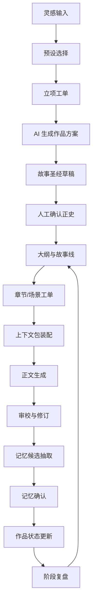
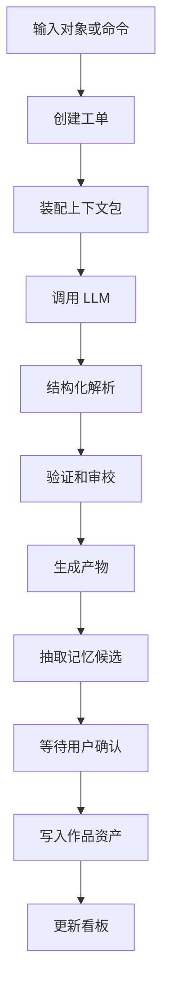

# 工作台优先创作闭环校验

## 1. 结论

左侧作品区、中间工作台、右侧作品看板这套布局是合理的，但它只解决空间分配问题，不能自动闭环小说创作。真正能闭环的是“创作工单 + AI 工作流 + 作品资产 + 记忆确认 + 阶段复盘”。

更稳妥的产品原则是：

> 工作台是真相源，AI 工作流是执行层，作品看板是闭环监控层，创作工单是推进状态对象，记忆确认是正史边界。

因此，Story Pilot 不需要把常驻聊天作为一级产品模式。自然语言入口应保留为命令面板，但每次输入都必须落到工单、对象操作或搜索结果。

## 2. 为什么不把聊天作为主界面

小说创作和通用任务执行不同：

- 作品不是一次性任务，而是长期生命体。
- 对话不是最终资产，人物、设定、章节、伏笔、时间线才是资产。
- AI 输出不能只作为回答展示，必须进入故事圣经、章节、记忆或工单。
- 创作不是完成一个 checklist，而是在多个故事线之间持续推进。
- 长篇一致性依赖正史边界，不能让一次回答自动污染后续生成。

如果把聊天放在主界面，产品会出现几个问题：

- 设定散落在历史消息中，难以维护。
- 用户要反复解释当前章节、人物和伏笔状态。
- AI 产物缺少明确入库动作。
- 右侧看板容易变成消息旁栏，而不是创作控制台。
- 长篇后期难以知道哪些内容是正史，哪些只是讨论。

## 3. 完整创作闭环

完整创作过程应闭环为：

如果某个环节缺失，产品会出现明显问题：

- 没有预设选择：新作者容易卡在空白页。
- 没有故事圣经：设定散落在临时结果里。
- 没有章节工单：AI 不知道本次生成要推进什么。
- 没有上下文包：长篇后期容易遗忘前文。
- 没有审校：生成速度提升但质量不可控。
- 没有记忆确认：错误设定会污染正史。
- 没有阶段复盘：作品会越写越散，无法完稿。

## 4. 核心状态对象：创作工单

创作工单是连接工作台、AI 工作流和作品看板的关键对象。

### 4.1 工单类型

- 立项工单：完成题材、读者、核心承诺和差异化定位。
- 世界观工单：生成或确认世界规则、力量体系和社会结构。
- 人物工单：生成人物卡、人物声音、关系和弧光。
- 大纲工单：生成全书、分卷、章节和场景计划。
- 章节工单：生成或修订某一章。
- 伏笔工单：埋设、强化、回收或废弃伏笔。
- 审校工单：检查连续性、风格、节奏、合规和版权风险。
- 记忆工单：确认新增、变更、冲突或废弃记忆。
- 复盘工单：总结阶段推进情况并生成下一阶段计划。

### 4.2 工单字段

每个工单至少包含：

- 所属作品。
- 工单类型。
- 当前状态。
- 目标。
- 作用范围。
- 输入对象。
- 关联记忆。
- 使用预设。
- 上下文包摘要。
- 期望产物。
- AI 工作流运行记录。
- 用户决策。
- 输出对象。
- 下一步建议。

### 4.3 工单状态

建议状态：

- 待开始。
- 信息待完善。
- 排队中。
- 运行中。
- 待用户确认。
- 风险待处理。
- 需修订。
- 已入库。
- 已完成。
- 已取消。

这套状态能让右侧作品看板真正有事可展示，也能让 AI 结果进入工作台，而不是停留在一次性回答中。

## 5. AI 工作流如何闭环

AI 工作流不是主界面，而是执行层。

每个工作流应遵循统一结构：

产品层只暴露用户能理解的动作：

- 生成章节草稿。
- 运行连续性审校。
- 生成伏笔回收方案。
- 补全人物动机。
- 生成候选名称。
- 抽取记忆候选。
- 生成下一步计划。

底层可以有多步骤提示词、工具调用和模型策略，但用户不需要先进入聊天模式才能使用。

## 6. 命令面板如何闭环

命令面板保留自然语言能力，但必须控制边界。

命令面板输入后的结果只能是：

- 搜索到作品对象。
- 调用当前对象的 AI 操作。
- 创建创作工单。
- 打开任务详情抽屉。
- 跳转到工作台处理位置。

命令面板不能把一段自由回答作为最终结果。否则用户仍然要把回答手工复制进故事圣经或章节正文，产品闭环会断。

## 7. 右侧作品看板如何闭环

右侧作品看板不能只是信息展示，它要回答四个问题：

- 当前作品进展到哪里？
- 当前有什么阻断创作的问题？
- AI 产出了什么可以处理的东西？
- 下一步应该做什么？

看板必须绑定工单状态：

- 进度来自章节工单和复盘工单。
- 任务来自 AI 工作流运行。
- 风险来自审校工单。
- 产物来自工作流输出。
- 记忆来自记忆工单。
- 上下文来自当前执行工单。

看板中的每个待处理项都要能跳转到中间主区完成处理。

## 8. 预设系统如何闭环

预设系统不是简单选项列表，而是创作初期和后续生成的约束来源。

预设闭环：

1. 用户选择题材、世界观、人物、冲突、节奏和风格预设。
2. 系统创建立项工单。
3. AI 工作流基于预设生成作品核心方案。
4. 用户确认后进入故事圣经草稿。
5. 部分内容确认后进入正史。
6. 后续章节生成时，预设作为上下文包的一部分参与生成。
7. 审校时检查章节是否偏离预设承诺。
8. 用户调整预设时，系统提示影响范围。

如果预设只在创建作品时使用一次，它的价值会很低。它必须持续影响生成、审校和复盘。

## 9. 元素生成器如何闭环

元素生成器必须和作品资产绑定。

闭环流程：

1. 用户选择元素类型，例如人物名、地名、组织名。
2. 系统读取当前题材、世界观、语言风格和已存在元素。
3. AI 工作流生成候选。
4. 用户筛选和组合。
5. 系统检查重名、风格冲突和设定冲突。
6. 用户把候选绑定到人物、地点、组织、章节或伏笔。
7. 绑定结果进入草稿。
8. 确认后进入正史或元素库。

否则元素生成器会变成孤立的起名工具，不能提升作品一致性。

## 10. MVP 必须验证的闭环

MVP 不需要做全量能力，但必须跑通最小闭环：

1. 左侧创建作品。
2. 工作台预设向导完成题材、读者、世界观、人物原型和节奏选择。
3. AI 工作流生成作品核心方案，并保存到故事圣经草稿。
4. 工作台确认故事圣经关键项。
5. 生成前 10 章大纲和第 1 章章节工单。
6. 根据章节工单生成正文。
7. 审校正文并提出风险。
8. 抽取记忆候选。
9. 用户确认记忆写入。
10. 右侧看板更新进度、产物、风险和下一步。
11. 阶段复盘生成第 2 章工单。

只要这个闭环跑通，即使没有聊天模式，产品也成立。

## 11. 设计风险与修正

### 11.1 风险：AI 功能碎片化

修正：所有 AI 操作必须有工单归属，产物必须有入库去向。

### 11.2 风险：命令面板退化成聊天

修正：命令面板输出工单预览和可执行动作，不输出游离长回答。

### 11.3 风险：右侧看板变成杂物间

修正：看板只展示当前作品和当前对象相关信息，并以工单状态驱动。

### 11.4 风险：预设导致套路化

修正：每个预设都必须展示常见风险和差异化建议；允许用户组合、改写和反套路。

### 11.5 风险：AI 越权修改作品

修正：AI 只能生成提案、草稿、候选记忆或补丁建议；正史、正文发布稿和关键设定必须由用户确认。

### 11.6 风险：工作台过重

修正：工作台默认展示最少必要字段，高级字段折叠；创作初期以预设和候选选择替代表单填写。

## 12. 最终设计判断

这套设计能够闭环完整创作过程的前提是：

- 左侧只负责作品空间管理，不承载复杂创作流程。
- 中间工作台是唯一主生产场。
- AI 能力嵌入对象操作、命令面板和任务抽屉。
- 右侧看板由真实工单和状态机驱动。
- 作品资产和长期记忆必须结构化。
- 关键正史变更必须有人类确认。
- 每个阶段都能生成下一步工单。

如果这些约束成立，三分区工作台方案可以覆盖从灵感、设定、大纲、正文、审校、记忆到复盘的完整创作链路。
