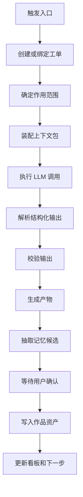

# AI 工作流产品模型

## 1. 定位

Story Pilot 的 AI 能力不以常驻聊天作为主要形态，而是以 AI 工作流的方式嵌入创作过程。

AI 工作流是一个可触发、可追踪、可确认、可复盘的创作动作。它可以由按钮、命令面板、看板待办或系统建议触发。

产品层定义：

```text
用户动作
  -> 创作工单
  -> AI 工作流
  -> 结构化产物
  -> 用户确认
  -> 写入作品资产
  -> 更新看板
```

## 2. 触发入口

### 2.1 对象级按钮

最主要入口。

示例：

- 章节页：生成草稿、续写、审校、抽取记忆。
- 人物页：生成名字、补全动机、检查弧光。
- 伏笔页：生成埋设、强化回收、检查遗忘。
- 大纲页：生成章节、调整节奏、设计反转。
- 记忆页：合并事实、解释冲突、分析影响。

### 2.2 AI 命令面板

用于开放需求和快速调用。

命令面板输入必须被系统归类为：

- 搜索作品对象。
- 触发对象级操作。
- 创建创作工单。
- 打开处理位置。

### 2.3 右侧看板

用于处理任务和风险。

示例：

- 点击“沈微澜知情程度冲突”。
- 打开风险详情。
- 系统推荐“生成修复方案”。
- 用户确认后创建审校修订工单。

### 2.4 系统建议

系统可以在阶段完成后生成下一步建议，但不能自动执行高风险写入。

示例：

- 第 1 章完成后建议创建第 2 章工单。
- 第一卷大纲完成后建议生成伏笔表。
- 记忆冲突过多时建议运行故事圣经整理。

## 3. 工作流标准结构

每个 AI 工作流都应有稳定结构：



## 4. 工作流输入

每个工作流必须明确输入。

通用输入：

- 作品 ID。
- 工单 ID。
- 触发入口。
- 作用范围。
- 当前对象。
- 用户目标。
- 使用预设。
- 正史记忆摘要。
- 相关章节摘要。
- 禁忌和风格约束。

章节生成输入：

- 本章目标。
- 场景卡。
- 需要推进的故事线。
- 可使用伏笔。
- 禁止提前暴露的信息。
- 人物当前状态。
- 叙事视角。
- 章节长度目标。

审校输入：

- 被审校文本。
- 正史记忆。
- 伏笔表。
- 人物状态。
- 时间线。
- 世界规则。
- 审校维度。

## 5. 工作流输出

工作流输出必须结构化。

通用输出：

- 产物类型。
- 产物正文或补丁。
- 适用对象。
- 风险列表。
- 使用上下文摘要。
- 记忆候选。
- 下一步建议。
- 是否需要用户确认。

禁止输出：

- 只给一段不可落库的长回答。
- 不说明来源的设定变更。
- 不绑定对象的候选名称。
- 不区分草稿和正史的事实。

## 6. P0 工作流列表

| 工作流 | 入口 | 主要产物 | 确认点 |
|---|---|---|---|
| 作品方案生成 | 预设向导 | 作品方案、故事圣经草稿 | 是否进入故事圣经 |
| 前 10 章大纲生成 | 大纲页、总览 | 章节大纲、场景卡 | 是否创建章节工单 |
| 章节草稿生成 | 章节页 | 章节版本 | 是否保存为当前版本 |
| 选区改写 | 编辑器选区 | 改写候选 | 是否替换原文 |
| 连续性审校 | 章节页、看板 | 风险报告 | 是否创建修订工单 |
| 记忆候选抽取 | 章节完成、对象变更 | 新增/变更/冲突记忆 | 是否写入正史 |
| 元素候选生成 | 元素生成器、命令面板 | 名称、标题、物件候选 | 是否绑定对象 |
| 伏笔方案生成 | 伏笔页、章节页 | 埋设/强化/回收方案 | 是否更新伏笔状态 |

## 7. 运行状态

建议状态：

- 待开始。
- 信息待完善。
- 排队中。
- 装配上下文。
- 调用模型。
- 解析输出。
- 自动审校。
- 待用户确认。
- 风险待处理。
- 已入库。
- 已完成。
- 已取消。
- 失败。

状态必须能在右侧看板和任务详情抽屉中展示。

## 8. 任务详情抽屉

任务详情抽屉是 AI 可观测性的主界面。

它展示：

- 工单目标。
- 作用范围。
- 当前状态。
- 上下文包摘要。
- 运行步骤。
- 产物卡。
- 风险卡。
- 记忆候选。
- 决策记录。
- 下一步建议。

它提供：

- 暂停。
- 取消。
- 重新运行。
- 修改输入。
- 应用产物。
- 保存为草稿。
- 加入记忆候选。
- 标记完成。

## 9. 用户确认边界

AI 工作流可以自动完成：

- 生成草稿。
- 生成候选。
- 生成审校报告。
- 生成记忆候选。
- 生成下一步建议。

AI 工作流不能自动完成：

- 覆盖正文发布稿。
- 修改正史记忆。
- 改变人物死亡、生还、背叛等关键状态。
- 改变世界底层规则。
- 回收或废弃关键伏笔。
- 导出发布稿并标记完成。

这些动作必须由用户确认。

## 10. 产品语言

推荐产品语言：

- AI 工作流。
- 创作工单。
- 上下文包。
- 产物。
- 记忆候选。
- 正史。
- 审校风险。
- 应用到当前对象。

不推荐产品语言：

- 聊天机器人。
- 智能体模式。
- 机器人思考。
- 自动写完。
- 自动更新正史。

产品语言应让用户理解自己在控制作品，而不是被 AI 接管创作。
